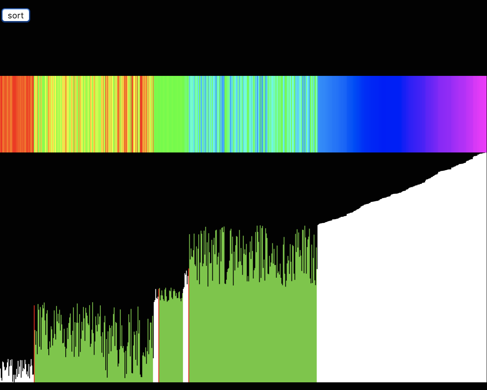

### Sorting Visualization ◼️◻️🔶🔷🔹🔸⬜⬛🔹

Quick sort is the fastest searching algorithm with average time commplexity of O(n*log(n)) and space complexity of O(n).

Inspired by work of [Daniel Shiffman](https://www.youtube.com/watch?v=eqo2LxRADhU)

